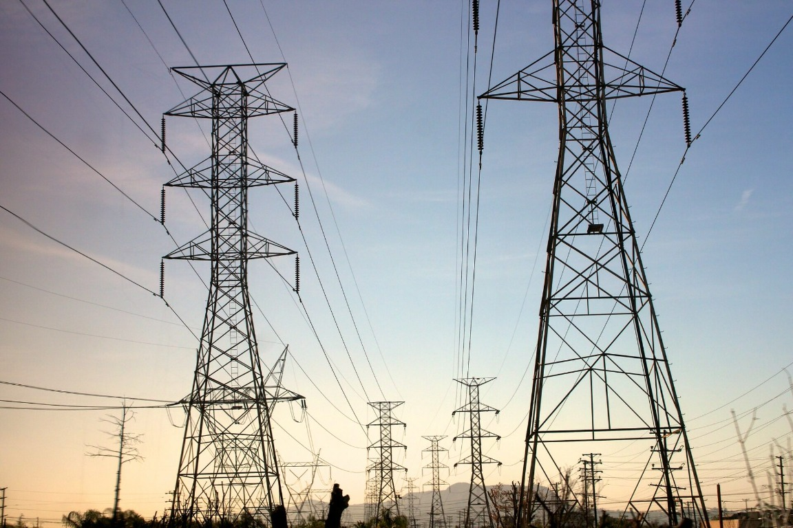
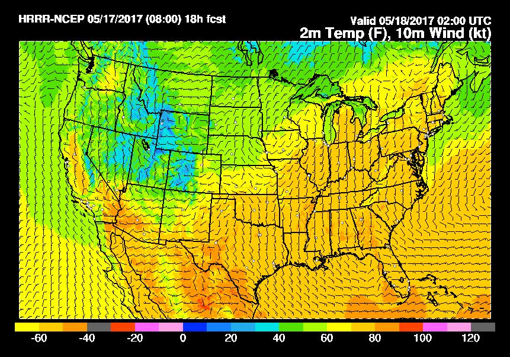
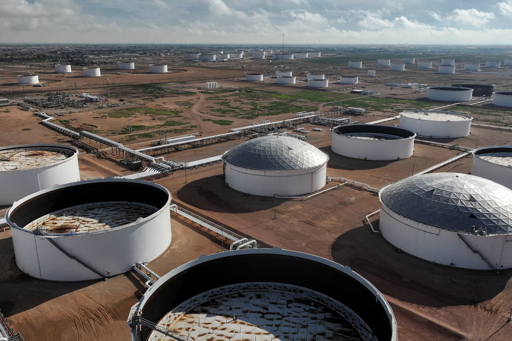
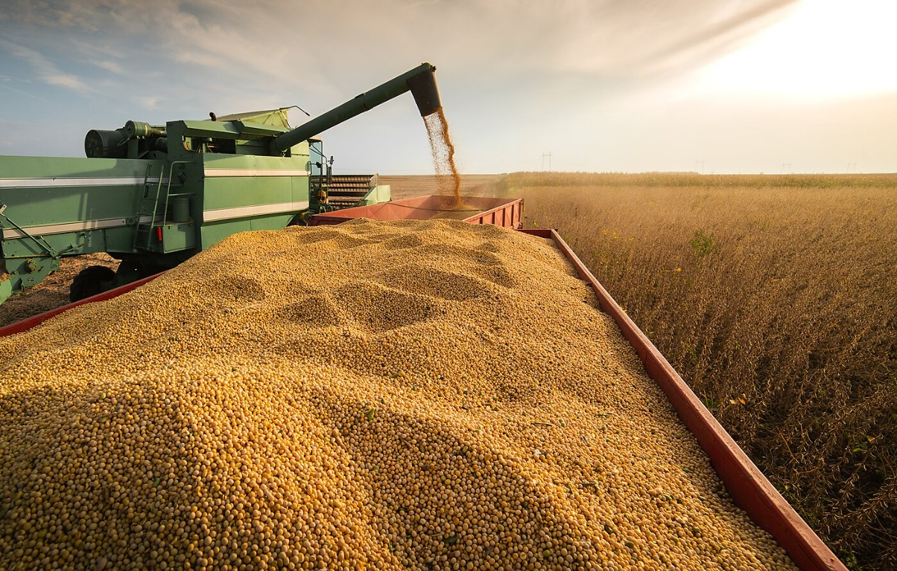

# Commodity Research

A Python workspace for commodity data, analytics, and market-specific research.

## Project layout

| Directory | Purpose |
| --- | --- |
| `config/` | Project settings and market calendars |
| `data/raw/` | Local source data and downloads |
| `data/lake/` | Local processed data and analytical datasets |
| `dags/` | Standalone Airflow workflows |
| `notebooks/` | Research and visualizations |
| `src/comm_research/infra/` | Database, scraper, and developer-tool infrastructure |
| `src/comm_research/common/` | Analytics shared across markets: math, curves, and models |
| `src/comm_research/markets/` | Commodity-specific research and analytics |

Local data and `.env` are excluded from Git.

## Markets

### Power & Gas

Spark spreads, nodal congestion, economic dispatch, renewables.

### Weather

Statistical methods for weather and atmospheric modeling.

### Oil

Crack spreads, crude, distillates, liquids.

### Agriculture

Crush spreads and crop progress.

